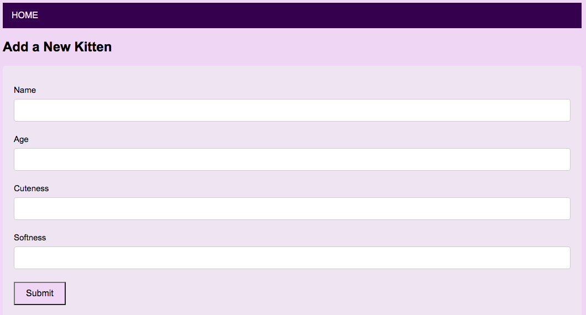

# Odin Kittens

## About

Odin Kittens is a project where a simple Rails app is set up to be a data-producing RESTful API.

It is part of The Odin Project's Ruby on Rails Curriculum (http://www.theodinproject.com).




## How to Use

```
$ git clone https://github.com/HannaEb/odin-kittens.git
$ cd odin-kittens
$ bundle
$ rake db:migrate
$ rails server
```
In your browser, enter http://localhost:3000/


## Testing

Not yet implemented.


## Author

HannaEb
